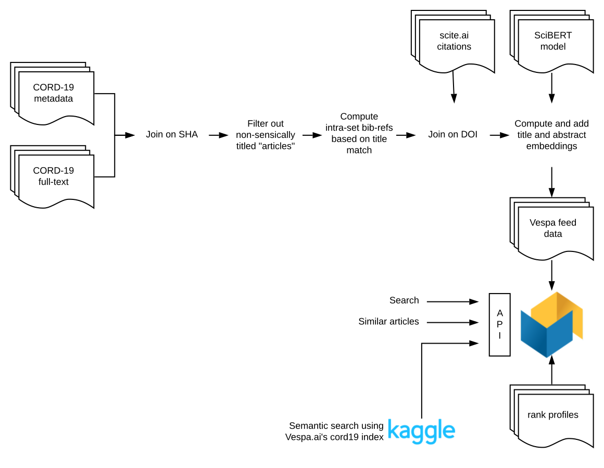

<!-- Copyright Verizon Media. Licensed under the terms of the Apache 2.0 license. See LICENSE in the project root. -->
# About CORD-19 Search
_CORD-19 Search_ is built on Vespa Cloud:

* Use the Query API to [search](https://docs.vespa.ai/documentation/querying-vespa.html).
* Use the left frame to navigate / drill down / refine the query -
  implemented using [Vespa Grouping](https://docs.vespa.ai/documentation/grouping.html)
* From the article view, find [similar/related articles](https://github.com/vespa-engine/cord-19/blob/master/cord-19-queries.md#user-content-related-articles-using-scibert-nli-embeddings) -
  implemented using SCIBERT-NLI embeddings.

The application is implemented as a
[Vespa Cloud sample application](https://github.com/vespa-engine/sample-apps/tree/master/vespa-cloud/cord-19-search).
Refer to [experiment yourself](https://github.com/vespa-engine/sample-apps/blob/master/vespa-cloud/cord-19-search/experiment-yourself.md)
to try out different rank profiles, including ML models.

Find the frontend code in this repo in [src/App](/src/App).

## Work notes
Use the scite.ai dataset citations,
and add these by matching the [DOI](https://en.wikipedia.org/wiki/Digital_object_identifier)
to those in the CORD-19 dataset.

Also plan to merge these citations with citations we find from the dataset
by matching a bibliography reference's title to titles in the data set.
(We find roughly 3x more citations that way,
but we have no way to extract sentiment (supporting, contradicting).

We also need some way to extract the citation passage,
i.e. the sentence(s) containing the reference.
